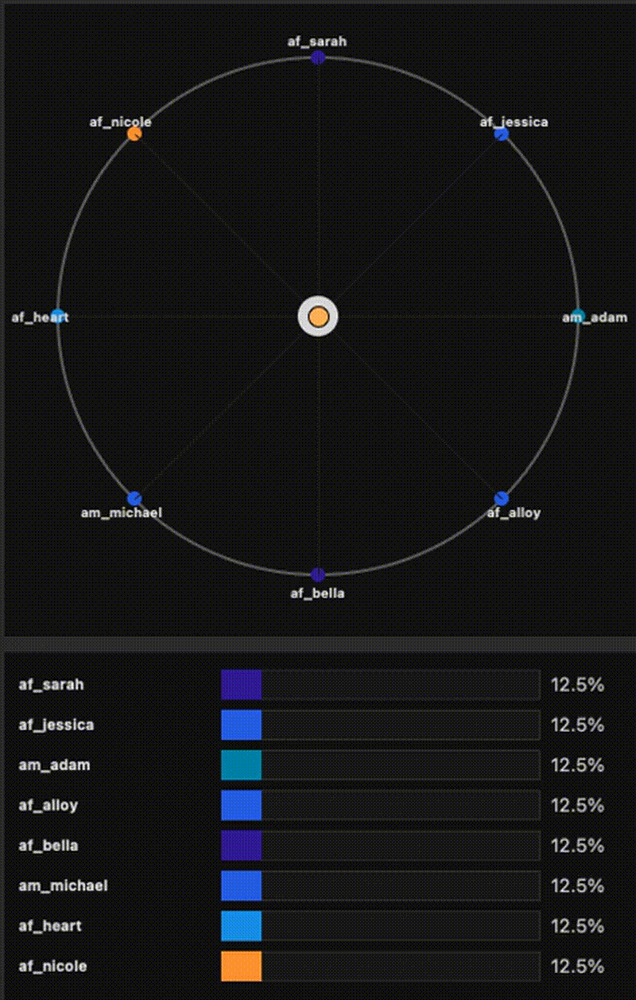
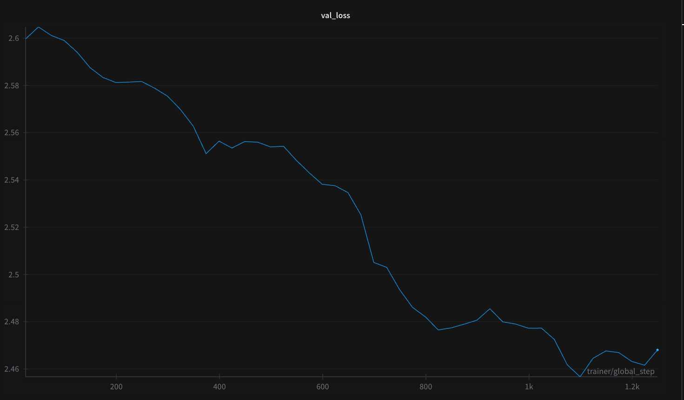

# Kokoro Fine-Tuning and Experimentation

This project is an ongoing **research and experimentation framework** around [Kokoro](https://huggingface.co/hexgrad/Kokoro-82M) — a super small, efficient text-to-speech (TTS) model.  
The focus is on **fine-tuning**, **optimizing and exploring voice embeddings**, and investigating future directions for adapting Kokoro to new speakers, styles, and research applications.
 
## Setup
First, set up the environment using the [Kokoro](https://huggingface.co/hexgrad/Kokoro-82M) codebase. Once setup is complete, try running inference on the model to get started — see `scripts/inference_kokoro.py` for an example.  
To experiment with different voices or perform small adjustment optimizations, run `scripts/download_voices.py` to download all available voices.

## Optimizing Kokoro Voices

The goal is to optimize voice embeddings for a dataset consisting of WAV files and their corresponding transcripts.  
We explore two optimization strategies:
You can experiment with mixing voices interactively using the GUI in `scripts/run_kokoro_voices.py`.  
The optimization code is located in `train_scripts/train_optimize_embedding.py` and supports both coefficient-based mixing and full embedding optimization.

### Small Adjustments

This approach optimizes a **low-dimensional vector of coefficients** applied to existing Kokoro voice embeddings.  
These coefficients serve as mixing weights that combine multiple pretrained voices into a new embedding.  
This lightweight method allows adapting Kokoro to a target voice without fully retraining the model.
You can generate a coefficient trajectory video, similar to the one shown in the results, using your W&B run data together with the visualization script in assets/optemize_voices/kokoro_coeff_viz.py.#### Results

<b>Show coefficient trajectory & audio samples</b>

 

   
  
    Example training trajectory of mixture weights in the circular embedding space.  
    (Run may not be fully converged yet — see the full logs on 
    <a href="https://wandb.ai/amit154154/kokoro_opt/runs/nrtl7bn1?nw=nwuseramit154154">W&B</a>)  
    &nbsp;•&nbsp;
    <a href="assets/optemize_voices/coeff_viz.mp4">Download MP4</a>
  

**Audio Samples**  
_GitHub tip: the README preview doesn’t always render audio players. Click a link below, then press **“View raw”** to play in your browser._

- ▶️ **Start Generation** — [WAV](assets/optemize_voices/start_generation.wav)  
- ▶️ **Optimized Generation** — [WAV](assets/optemize_voices/optemize_generation.wav)  
- ▶️ **Ground Truth** — [WAV](assets/optemize_voices/ground_truth.wav)  

  
   <em>Loss curve showing convergence during coefficient optimization <a href="https://wandb.ai/amit154154/kokoro_opt/runs/nrtl7bn1?nw=nwuseramit154154">W&B</a>.</em>

## Goals and Research Directions

- ✅ Implement optimization for voice embeddings (both simple coefficient mixing and full embedding)  
- ✅ Train simple coefficients on a LibriTTS speaker and analyze trajectory + results  
- [ ] Train simple coefficients on synthetic predefined speaker voices and visualize trajectories/results  
- [ ] Optimize simple coefficients on a random ensemble of voice embeddings and inspect trajectories  
- [ ] Explore different optimizers (AdamW, etc.) and compare trajectory smoothness & convergence speed  
- [ ] Optimize the full embedding and compare results against coefficient-based optimization  
- [ ] Optimize and fine-tune selected parts of the Kokoro model; compare results to embedding-only methods  
- [ ] Implement speaker description → voice embedding mapping using LibriTTS + Qwen embeddings (semantic → acoustic mapper) 